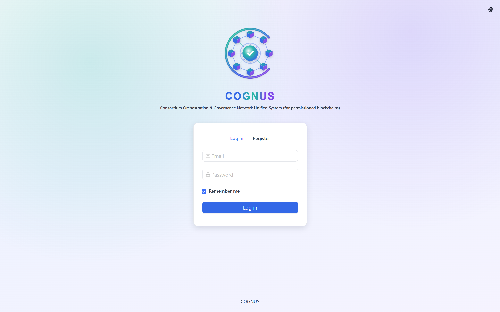
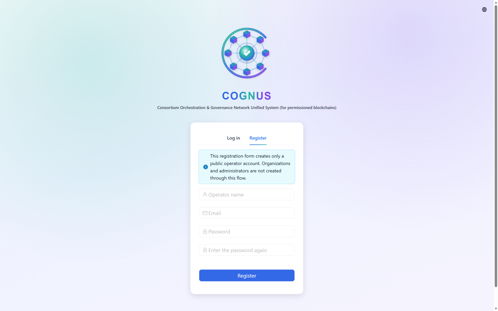
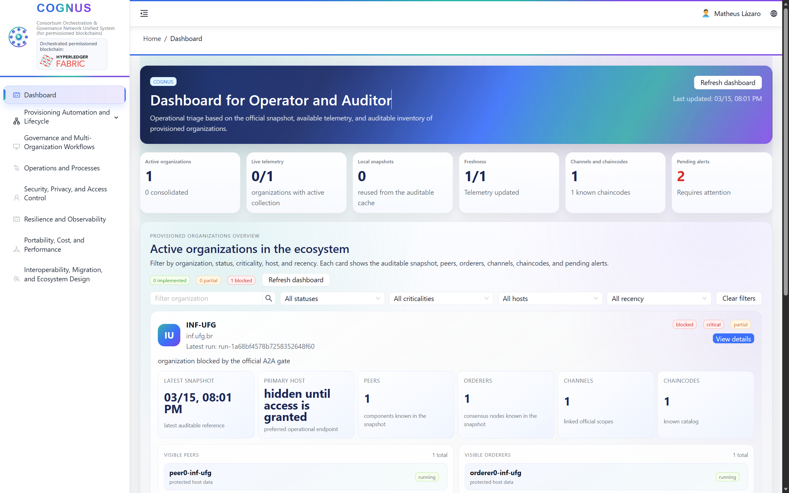
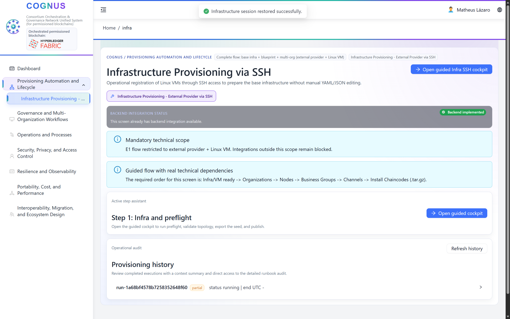
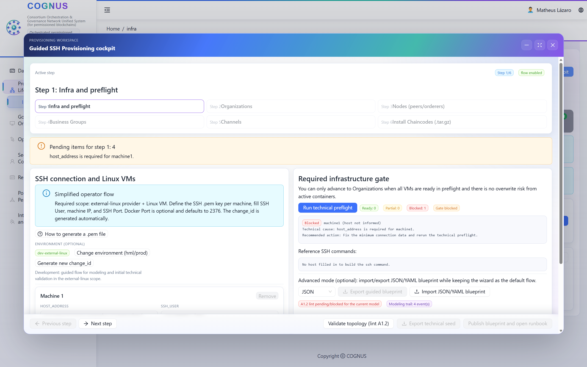
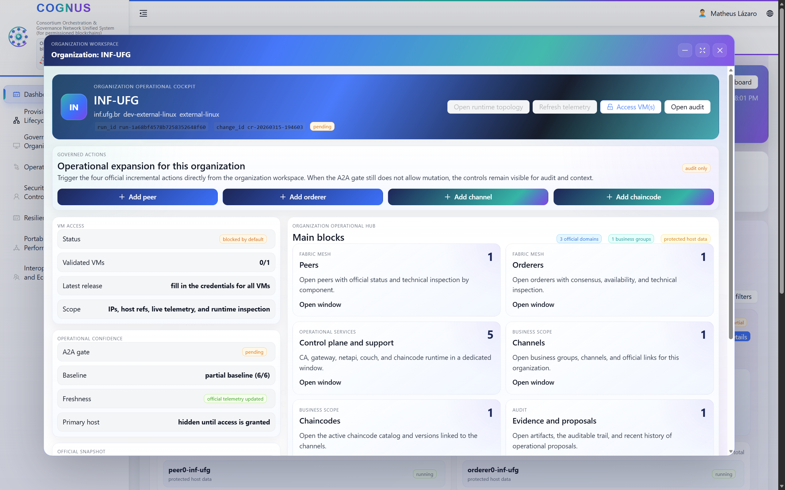
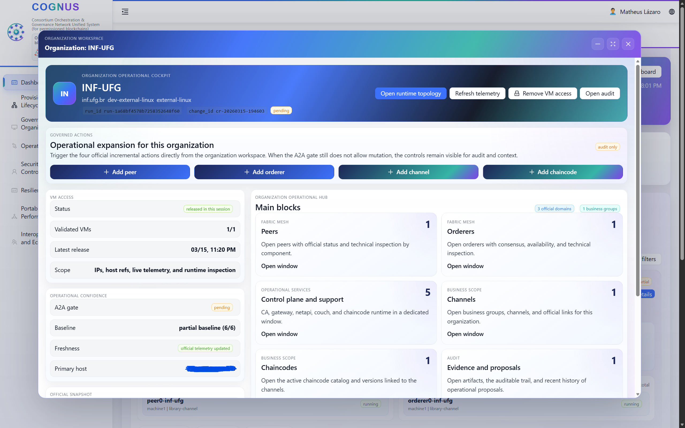
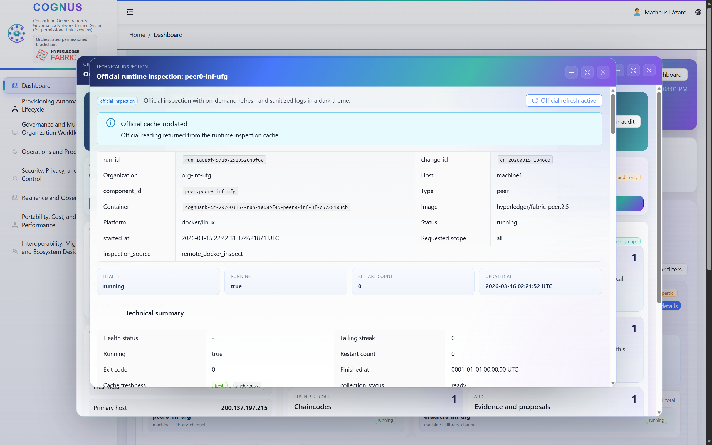
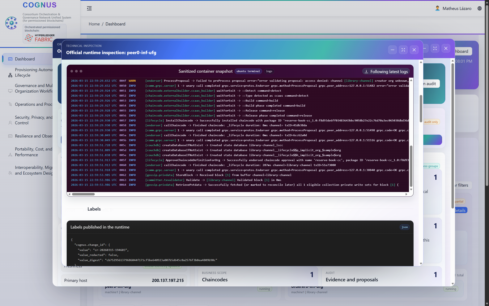
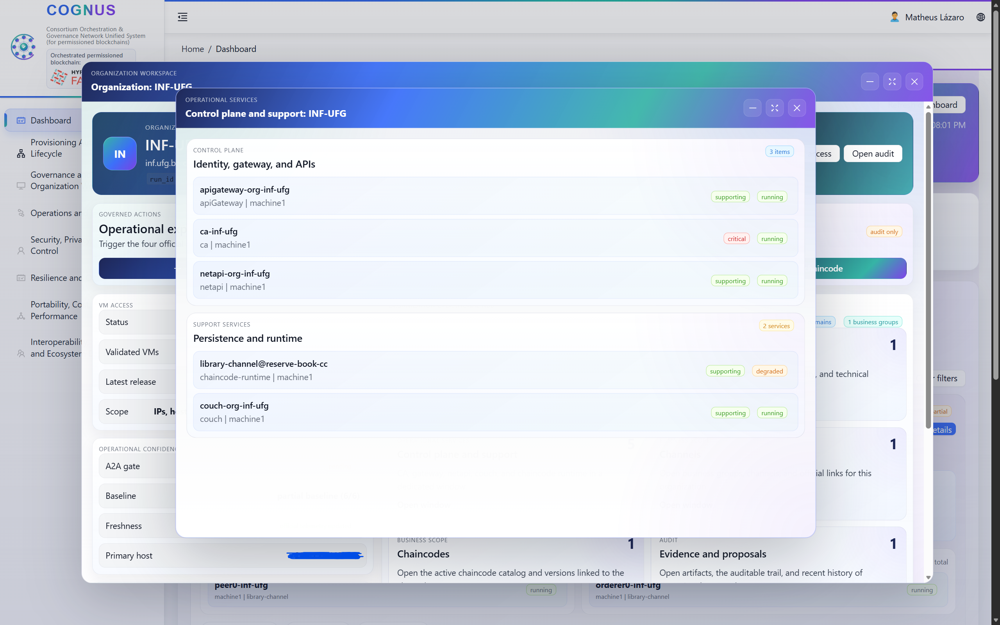

# Public Endpoint Walkthrough

This guide documents the published access path for the current COGNUS baseline and the main screens that can be inspected from the web interface.

## Published Access

- Public endpoint: `http://200.137.197.215:8081`
- Access mode: self-registration is enabled for the `operator` role.
- Primary use in this guide: inspect the currently implemented operator flow and its published screens.

## Scope Of The Published Endpoint

The public endpoint is intended to expose the current baseline already described in the article and in the repository documentation. Through it, the user can:

- register a public `operator` account;
- log in and inspect the overview dashboard;
- navigate the `Provisioning automation and lifecycle` area;
- inspect the guided SSH provisioning cockpit and the organization workspace views;
- inspect runtime-oriented views such as official runtime inspection, logs, and control-plane support screens.

Real SSH-backed provisioning remains possible only when the user supplies a target Linux host together with the corresponding host/IP and access credentials. Those target credentials are external to the public artifact.

## Recommended Walkthrough

### 1. Open The Login Screen

Access the published endpoint in a web browser:

```text
http://200.137.197.215:8081
```

The first screen is the login page of the published dashboard.



### 2. Register A Public Operator Account

Use the registration flow to create a public `operator` account. This is the expected entry point for someone inspecting the published baseline without private bootstrap credentials.



### 3. Inspect The Overview Dashboard

After authentication, confirm access to the overview dashboard and inspect the current operational summary presented by the system.



### 4. Open Provisioning And Lifecycle Automation

From the navigation menu, open `Provisioning automation and lifecycle` (pt-BR UI label: `Automação de provisão e lifecycle`) and then the SSH-oriented infrastructure provisioning flow. This is the main entry point for the implemented provisioning baseline described in the article.



### 5. Inspect The Guided SSH Provisioning Cockpit

The guided cockpit organizes the operational sequence into explicit stages and checkpoints. This is the central screen for understanding the current SSH-backed provisioning journey.



### 6. Inspect The Organization Workspace

The organization workspace exposes views related to infrastructure access and runtime status. The published baseline includes screens for VM access gating and activation state.

Blocked or pending VM access state:



Enabled VM access state:



### 7. Inspect Runtime And Evidence-Oriented Views

The current baseline also exposes runtime-oriented inspection and operational evidence views, including official runtime inspection and logs.

Official runtime inspection:



Logs view:



### 8. Inspect Control Plane And Support Views

The organization workspace also includes control-plane and support-oriented views that complement the published operational baseline.



## Optional Real Provisioning

If the user intends to go beyond screen inspection and exercise SSH-backed provisioning, the required inputs are external to the public artifact:

- target host/IP;
- SSH user;
- password or private key;
- Linux host with Docker support or permission for Docker installation.

This keeps the published repository free of private credentials while still exposing the implemented product flow and the public access path required for assessment.

## Related Material

- [README.md](../README.md)
- [ARTIFACT.md](../ARTIFACT.md)
- [PREREQUISITES.md](../PREREQUISITES.md)
- [auto-provisioning.md](auto-provisioning.md)
